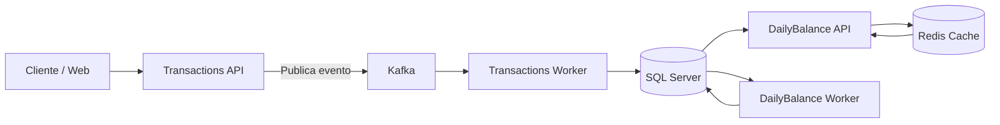

# Contoso Cash Flow Management

PoC em C# para o desafio de arquitetura de software: controlar lançamentos de caixa (débitos e créditos) e expor o saldo diário consolidado com foco em escalabilidade, resiliência e simplicidade adequada para entrevista.

## Visão Geral

A solução foi organizada em serviços separados por responsabilidade:

- `Contoso.Transactions.API`
  Responsável por receber lançamentos e consultar lançamentos de um dia.
- `Contoso.Transactions.Worker`
  Consome eventos do Kafka e persiste os lançamentos no SQL Server.
- `Contoso.DailyBalance.API`
  Expõe o saldo consolidado diário.
- `Contoso.DailyBalance.Worker`
  Materializa o saldo de fechamento do dia anterior.
- `Contoso.Web`
  Frontend Blazor para navegação básica da PoC.
- `Contoso.AppHost`
  Orquestra toda a solução com .NET Aspire.

## Decisões Arquiteturais

### 1. Escrita assíncrona para desacoplar o consolidado

O requisito principal do desafio diz que o serviço de lançamentos não deve ficar indisponível se o consolidado cair. Para isso, o `POST /lancamentos` publica o comando em Kafka e responde `202 Accepted`; a persistência final acontece no `Transactions.Worker`.

### 2. Banco como fonte de verdade financeira

SQL Server é a fonte de verdade. Redis não participa da consistência financeira; ele foi mantido apenas como cache de leitura curta do consolidado.

### 3. Idempotência no write path

Cada lançamento aceita `X-Idempotency-Key`. Se o cliente repetir a mesma operação com o mesmo GUID, a persistência não duplica o evento graças ao `RequestId` com índice único no banco.

### 4. Saldo consolidado como saldo acumulado até o fechamento do dia

O saldo retornado por `/consolidado/{data}` representa o saldo acumulado até `23:59:59` UTC do dia solicitado. O serviço:

- usa saldo materializado do dia, quando existir;
- senão, parte do último saldo persistido anterior;
- soma apenas o delta de transações necessário;
- devolve o resultado e o coloca em cache por poucos segundos.

### 5. Worker diário para materialização

O `DailyBalance.Worker` roda por cron e grava o saldo do dia anterior em `balances`, reduzindo custo de leitura para consultas históricas.

### 6. Segurança simples, suficiente para a PoC

Foi mantida autenticação por `X-API-KEY`, configurável por `appsettings`. Para o contexto da entrevista, isso entrega proteção básica sem inflar o escopo com OAuth/JWT.

## Fluxo da Solução



## Melhorias Implementadas

- correção do baseline do Aspire e atualização dos pacotes para versão compatível;
- remoção de uso incorreto de `long` em valores monetários;
- cache de saldo refeito para `decimal`;
- inclusão de `RequestId` com índice único para idempotência;
- listagem de lançamentos com filtro por faixa UTC e paginação estável;
- worker diário corrigido, com cron finito e sem loop defeituoso;
- frontend deixando de acessar `DbContext` diretamente;
- API key agora lida de configuração;
- migrations alinhadas com o modelo atual;
- build limpo e testes automatizados passando.

## Requisitos Não Funcionais Atendidos

- `Transactions` continua disponível mesmo se `DailyBalance` falhar, porque a entrada de lançamentos não depende do serviço de consolidado.
- O consolidado usa saldo materializado + cache curto para reduzir custo de leitura.
- A solução está preparada para escala horizontal no lado de API, com persistência idempotente e processamento assíncrono.
- O AppHost do Aspire facilita observabilidade operacional e composição local da PoC.

## Tecnologias

- .NET 8
- C#
- .NET Aspire
- SQL Server
- Kafka
- Redis
- Blazor
- xUnit
- Testcontainers

## Como Rodar Localmente

### Pré-requisitos

- .NET 8 SDK
- Docker Desktop
- certificado HTTPS de desenvolvimento confiável (`dotnet dev-certs https --trust`, se necessário)

### Passos

1. Restaurar e compilar:

```bash
dotnet restore
dotnet build Contoso.sln --nologo
```

2. Subir a solução pelo Aspire:

```bash
dotnet run --project src/Contoso.AppHost
```

3. Abrir o dashboard do Aspire e usar os endpoints publicados para:

- `webfrontend`
- `transactions-api`
- `dailybalance-api`

## API Key

Por padrão a PoC usa:

```text
X-API-KEY: contoso
```

Esse valor está configurado em `appsettings.json` e pode ser trocado sem mudar código.

## Exemplos de Uso

Substitua `BASE_TRANSACTIONS_URL` e `BASE_DAILYBALANCE_URL` pelos endereços mostrados no Aspire Dashboard.

### Criar lançamento

```bash
curl --location 'BASE_TRANSACTIONS_URL/lancamentos' \
--header 'X-API-KEY: contoso' \
--header 'X-Idempotency-Key: 11111111-1111-1111-1111-111111111111' \
--header 'Content-Type: application/json' \
--data '{
  "amount": 150.75,
  "description": "Venda no caixa"
}'
```

### Listar lançamentos do dia

```bash
curl --location 'BASE_TRANSACTIONS_URL/lancamentos/2026-05-18?page=0&limit=10' \
--header 'X-API-KEY: contoso'
```

### Consultar saldo consolidado

```bash
curl --location 'BASE_DAILYBALANCE_URL/consolidado/2026-05-18' \
--header 'X-API-KEY: contoso'
```

## Testes

```bash
dotnet test Contoso.sln --no-build --nologo --blame-hang --blame-hang-timeout 5m
```

Cobertura atual validada:

- cálculo e cache do saldo diário;
- smoke test do frontend;
- build da solução sem warnings.

## Trade-offs Assumidos

- o `POST /lancamentos` responde `202 Accepted` em vez de confirmação síncrona de persistência;
- a autenticação é simples por API key, propositalmente;
- a materialização do saldo diário usa worker agendado, não stream processing contínuo;
- a consistência entre publicação e persistência ainda é de PoC, sem outbox transacional completo.

## Evoluções Futuras Recomendadas

- implementar `Outbox/Inbox` para garantir publicação e consumo exatamente uma vez no fluxo distribuído;
- adicionar endpoint de consulta por `RequestId` para acompanhamento do processamento assíncrono;
- criar testes distribuídos completos cobrindo AppHost + Kafka + fluxo funcional ponta a ponta;
- expor métricas e SLOs para taxa de erro, latência e backlog de processamento;
- mover API key para secret store central se a PoC evoluir para ambiente real;
- criar projeções adicionais para relatórios e analytics sem pressionar o write model;
- adicionar rate limit e auditoria por cliente.

## Documentação no Repositório

- `README.md`
- `.backlog/0001-analise-arquitetural-desafio-jan25.md`
- `.backlog/0002-implementar-melhorias-poc-arquitetura.md`
- `.backlog/_knowledge/arquitetura.md`

## Resumo Final

Esta PoC ficou intencionalmente simples, mas com decisões arquiteturais defensáveis:

- separação entre entrada de lançamentos e leitura consolidada;
- persistência durável como base financeira;
- cache somente como acelerador;
- idempotência no write path;
- documentação clara de trade-offs e próximos passos.
